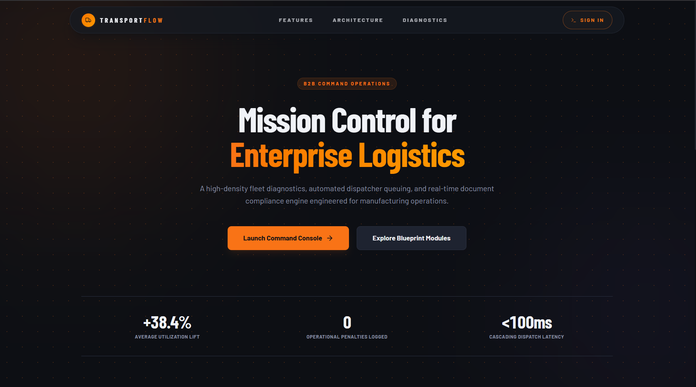

# 🚛 TransportFlow — Transport Management System

> A full-stack MERN application for managing logistics, vehicle tracking, driver assignments, trip scheduling, and delivery workflows for a manufacturing company.

---

## 📋 Table of Contents

- [Project Overview](#-project-overview)
- [Features](#-features)
- [Tech Stack](#-tech-stack)
- [Project Structure](#-project-structure)
- [Database Schema](#-database-schema)
- [API Reference](#-api-reference)
- [Environment Variables](#-environment-variables)
- [Local Setup & Installation](#-local-setup--installation)
- [Running the Application](#-running-the-application)
- [Default Login Credentials](#-default-login-credentials)
- [Role-Based Access](#-role-based-access)
- [Key Workflows](#-key-workflows)
- [Deployment](#-deployment)
- [Git Commit Strategy](#-git-commit-strategy)
- [Screenshots](#-screenshots)
- [Author](#-author)

---

## 🔍 Project Overview

**TransportFlow** is a transport management module built for manufacturing companies to streamline their entire logistics pipeline — from vehicle procurement and driver management to trip scheduling, live status tracking, and delivery confirmation.

The system supports three user roles (Admin, Manager, Dispatcher) and provides a real-time dashboard with KPIs, fleet utilization charts, and compliance alerts for document expiry (insurance, fitness, permits).

---

## ✅ Features

### 🏠 Dashboard
- Live KPI cards: total vehicles, active trips, pending deliveries, driver count
- Fleet utilization chart (available / in-transit / maintenance)
- Recent trips feed with status indicators
- Compliance alerts for vehicles with expiring documents (insurance, fitness, permit)
- Monthly delivery performance bar chart

### 🚗 Vehicle Management
- Add, edit, deactivate vehicles with full details (registration, type, make, model, year, capacity)
- Track vehicle status: `available` | `in-transit` | `maintenance` | `retired`
- Supported types: Truck, Van, Trailer, Pickup, Tanker, Container
- Fuel types: Diesel, Petrol, CNG, Electric
- Document expiry tracking: Insurance, Fitness Certificate, Permit
- Service history: last service date, next service due, mileage
- Assign/unassign drivers to vehicles
- Location field with last-known address

### 👨‍✈️ Driver Management
- Complete driver profiles: name, license number, license expiry, contact, address
- License categories: LMV, HMV, HPMV, Transport
- Status tracking: `available` | `on-trip` | `off-duty` | `suspended`
- Experience tracking and performance ratings
- Emergency contact information
- Link drivers to assigned vehicles

### 🗺️ Trip Management
- Create trips with origin → destination, scheduled departure/arrival
- Assign vehicle + driver per trip
- Trip status workflow: `scheduled` → `loading` → `in-transit` → `delivered` → `completed`
- Distance (km) and estimated duration tracking
- Cargo details: description, weight, value, special instructions
- Trip notes and route information
- Auto-updates vehicle and driver status on trip state changes

### 📦 Delivery Management
- Create delivery orders linked to trips
- Consignee details: name, contact, address
- Delivery slots and priority levels: `low` | `medium` | `high` | `urgent`
- Status workflow: `pending` → `dispatched` → `out-for-delivery` → `delivered` | `failed`
- Proof of delivery: recipient name, signature flag, delivery notes
- Failed delivery reason tracking and rescheduling

### 🔐 Authentication & Authorization
- JWT-based authentication (7-day token expiry)
- Role-based access control: Admin, Manager, Dispatcher
- Protected routes on both frontend and backend
- Password hashing with bcryptjs

---

## 🛠 Tech Stack

| Layer | Technology |
|-------|-----------|
| **Frontend** | React 18, React Router v6, Axios, Recharts, React Icons |
| **Backend** | Node.js, Express.js 4 |
| **Database** | MongoDB with Mongoose ODM |
| **Auth** | JSON Web Tokens (JWT) + bcryptjs |
| **Dev Tools** | Nodemon, Concurrently, Morgan |
| **Styling** | CSS Modules / Custom CSS with CSS Variables |
| **Deployment** | Render (backend) + Vercel (frontend) or Railway (full-stack) |

---

## 📁 Project Structure

```
transport-module/
│
├── server/                         # Express backend
│   ├── index.js                    # Server entry point
│   ├── models/
│   │   ├── User.js                 # User schema (auth)
│   │   ├── Vehicle.js              # Vehicle schema
│   │   ├── Driver.js               # Driver schema
│   │   ├── Trip.js                 # Trip schema
│   │   └── Delivery.js             # Delivery schema
│   ├── routes/
│   │   ├── auth.js                 # POST /login, /register, GET /me
│   │   ├── vehicles.js             # CRUD for vehicles
│   │   ├── drivers.js              # CRUD for drivers
│   │   ├── trips.js                # CRUD + status update for trips
│   │   ├── deliveries.js           # CRUD + status update for deliveries
│   │   └── dashboard.js            # Aggregated stats endpoint
│   ├── controllers/
│   │   ├── authController.js
│   │   ├── vehicleController.js
│   │   ├── driverController.js
│   │   ├── tripController.js
│   │   ├── deliveryController.js
│   │   └── dashboardController.js
│   └── middleware/
│       ├── auth.js                 # JWT verification middleware
│       └── roles.js                # Role-based access middleware
│
├── client/                         # React frontend
│   ├── public/
│   └── src/
│       ├── components/
│       │   ├── layout/
│       │   │   ├── Sidebar.jsx
│       │   │   ├── Navbar.jsx
│       │   │   └── ProtectedRoute.jsx
│       │   ├── dashboard/
│       │   │   ├── KPICard.jsx
│       │   │   ├── FleetChart.jsx
│       │   │   ├── RecentTrips.jsx
│       │   │   └── ComplianceAlerts.jsx
│       │   ├── vehicles/
│       │   │   ├── VehicleTable.jsx
│       │   │   ├── VehicleForm.jsx
│       │   │   └── VehicleCard.jsx
│       │   ├── drivers/
│       │   │   ├── DriverTable.jsx
│       │   │   └── DriverForm.jsx
│       │   ├── trips/
│       │   │   ├── TripTable.jsx
│       │   │   ├── TripForm.jsx
│       │   │   └── TripStatusBadge.jsx
│       │   ├── deliveries/
│       │   │   ├── DeliveryTable.jsx
│       │   │   └── DeliveryForm.jsx
│       │   └── common/
│       │       ├── Modal.jsx
│       │       ├── Loader.jsx
│       │       ├── StatusBadge.jsx
│       │       └── ConfirmDialog.jsx
│       ├── pages/
│       │   ├── Login.jsx
│       │   ├── Dashboard.jsx
│       │   ├── Vehicles.jsx
│       │   ├── Drivers.jsx
│       │   ├── Trips.jsx
│       │   └── Deliveries.jsx
│       ├── context/
│       │   └── AuthContext.jsx     # Global auth state
│       ├── hooks/
│       │   └── useApi.js           # Custom Axios hook with auth header
│       ├── utils/
│       │   ├── api.js              # Axios instance + interceptors
│       │   └── helpers.js          # Date formatters, status colors, etc.
│       ├── App.jsx
│       └── index.js
│
├── .env.example                    # Environment variables template
├── .gitignore
├── package.json                    # Root package.json (runs both)
└── README.md
```

---

## 🗄️ Database Schema

### User
| Field | Type | Description |
|-------|------|-------------|
| name | String | Full name |
| email | String | Unique, used for login |
| password | String | Bcrypt hashed |
| role | Enum | `admin` \| `manager` \| `dispatcher` |
| isActive | Boolean | Account status |

### Vehicle
| Field | Type | Description |
|-------|------|-------------|
| registrationNumber | String | Unique, uppercase |
| type | Enum | truck, van, trailer, pickup, tanker, container |
| make / model / year | String/Number | Vehicle identity |
| capacity | Object | `{ value, unit }` |
| status | Enum | available, in-transit, maintenance, retired |
| fuelType | Enum | diesel, petrol, cng, electric |
| currentLocation | Object | `{ lat, lng, address, updatedAt }` |
| mileage | Number | Odometer reading (km) |
| lastServiceDate | Date | Last maintenance date |
| nextServiceDue | Date | Next scheduled service |
| insuranceExpiry | Date | Insurance document expiry |
| fitnessExpiry | Date | Fitness certificate expiry |
| permitExpiry | Date | Route permit expiry |
| assignedDriver | ObjectId | Ref → Driver |

### Driver
| Field | Type | Description |
|-------|------|-------------|
| name | String | Full name |
| licenseNumber | String | Unique driving license |
| licenseExpiry | Date | License validity |
| licenseType | Enum | LMV, HMV, HPMV, Transport |
| phone | String | Primary contact |
| email | String | Optional |
| address | String | Residential address |
| status | Enum | available, on-trip, off-duty, suspended |
| experience | Number | Years of experience |
| rating | Number | 1–5 performance rating |
| emergencyContact | Object | `{ name, phone, relation }` |
| assignedVehicle | ObjectId | Ref → Vehicle |

### Trip
| Field | Type | Description |
|-------|------|-------------|
| tripNumber | String | Auto-generated (TRP-YYYYMMDD-XXX) |
| vehicle | ObjectId | Ref → Vehicle |
| driver | ObjectId | Ref → Driver |
| origin | Object | `{ address, lat, lng }` |
| destination | Object | `{ address, lat, lng }` |
| scheduledDeparture | Date | Planned start time |
| scheduledArrival | Date | Planned end time |
| actualDeparture | Date | Real departure time |
| actualArrival | Date | Real arrival time |
| status | Enum | scheduled, loading, in-transit, delivered, completed, cancelled |
| distance | Number | Total km |
| cargo | Object | `{ description, weight, value, specialInstructions }` |
| notes | String | Trip notes |
| createdBy | ObjectId | Ref → User |

### Delivery
| Field | Type | Description |
|-------|------|-------------|
| deliveryNumber | String | Auto-generated (DEL-YYYYMMDD-XXX) |
| trip | ObjectId | Ref → Trip |
| consignee | Object | `{ name, phone, email, address }` |
| scheduledDate | Date | Planned delivery date |
| deliverySlot | String | Morning / Afternoon / Evening |
| priority | Enum | low, medium, high, urgent |
| status | Enum | pending, dispatched, out-for-delivery, delivered, failed |
| proofOfDelivery | Object | `{ recipientName, signatureObtained, notes, deliveredAt }` |
| failureReason | String | If delivery failed |
| rescheduledDate | Date | For failed → rescheduled |

---

## 🔌 API Reference

### Auth Routes — `/api/auth`
| Method | Endpoint | Access | Description |
|--------|----------|--------|-------------|
| POST | `/register` | Public | Register new user |
| POST | `/login` | Public | Login, returns JWT |
| GET | `/me` | Private | Get current user profile |

### Vehicle Routes — `/api/vehicles`
| Method | Endpoint | Access | Description |
|--------|----------|--------|-------------|
| GET | `/` | Private | Get all vehicles (filter by status/type) |
| GET | `/:id` | Private | Get vehicle by ID |
| POST | `/` | Admin/Manager | Create new vehicle |
| PUT | `/:id` | Admin/Manager | Update vehicle |
| PATCH | `/:id/status` | Admin/Manager | Update vehicle status |
| DELETE | `/:id` | Admin | Delete vehicle |

### Driver Routes — `/api/drivers`
| Method | Endpoint | Access | Description |
|--------|----------|--------|-------------|
| GET | `/` | Private | Get all drivers (filter by status) |
| GET | `/:id` | Private | Get driver by ID |
| POST | `/` | Admin/Manager | Create new driver |
| PUT | `/:id` | Admin/Manager | Update driver |
| PATCH | `/:id/status` | Admin/Manager | Update driver status |
| DELETE | `/:id` | Admin | Delete driver |

### Trip Routes — `/api/trips`
| Method | Endpoint | Access | Description |
|--------|----------|--------|-------------|
| GET | `/` | Private | Get all trips (filter by status/date) |
| GET | `/:id` | Private | Get trip by ID (populated) |
| POST | `/` | Admin/Manager | Create new trip |
| PUT | `/:id` | Admin/Manager | Update trip |
| PATCH | `/:id/status` | Private | Update trip status |
| DELETE | `/:id` | Admin | Cancel/delete trip |

### Delivery Routes — `/api/deliveries`
| Method | Endpoint | Access | Description |
|--------|----------|--------|-------------|
| GET | `/` | Private | Get all deliveries (filter by status/priority) |
| GET | `/:id` | Private | Get delivery by ID |
| POST | `/` | Admin/Manager | Create new delivery |
| PUT | `/:id` | Admin/Manager | Update delivery |
| PATCH | `/:id/status` | Private | Update delivery status |
| DELETE | `/:id` | Admin | Delete delivery |

### Dashboard Route — `/api/dashboard`
| Method | Endpoint | Access | Description |
|--------|----------|--------|-------------|
| GET | `/stats` | Private | KPIs: vehicle, driver, trip, delivery counts |
| GET | `/fleet-status` | Private | Fleet utilization breakdown |
| GET | `/recent-trips` | Private | Last 5 trips with populated data |
| GET | `/compliance-alerts` | Private | Vehicles with documents expiring in 30 days |
| GET | `/monthly-performance` | Private | Monthly delivery stats (last 6 months) |

---

## 🔑 Environment Variables

Create a `.env` file in the **root directory** (same level as `package.json`) by copying `.env.example`:

```bash
cp .env.example .env
```

Then fill in the values:

```env
# Server
PORT=5000
NODE_ENV=development

# MongoDB — use your local URI or a MongoDB Atlas connection string
MONGO_URI=mongodb://localhost:27017/transport_module

# JWT — use a long, random, secret string (never commit the real value)
JWT_SECRET=your_super_secret_jwt_key_change_this_in_production
JWT_EXPIRE=7d
```

> ⚠️ **Never commit your actual `.env` file to Git.** The `.gitignore` already excludes it.

---

## 💻 Local Setup & Installation

### Prerequisites

Make sure you have the following installed:

- **Node.js** v18+ — [Download](https://nodejs.org/)
- **npm** v9+ (comes with Node)
- **MongoDB** v6+ running locally — [Download](https://www.mongodb.com/try/download/community) or use [MongoDB Atlas](https://www.mongodb.com/cloud/atlas)
- **Git** — [Download](https://git-scm.com/)

### Step 1 — Clone the Repository

```bash
git clone https://github.com/YOUR_USERNAME/transport-module.git
cd transport-module
```

### Step 2 — Configure Environment Variables

```bash
cp .env.example .env
```

Open `.env` and set your `MONGO_URI` and `JWT_SECRET`.

### Step 3 — Install All Dependencies

```bash
npm run install-all
```

This installs both root (backend) and `client/` (frontend) dependencies in one command.

Alternatively, install manually:

```bash
# Backend dependencies
npm install

# Frontend dependencies
cd client && npm install && cd ..
```

### Step 4 — Seed the Database (Optional but Recommended)

```bash
node server/seed.js
```

This creates sample users, vehicles, drivers, trips, and deliveries for testing.

---

## ▶️ Running the Application

### Development Mode (Both servers with hot reload)

```bash
npm run dev
```

This runs:
- **Backend** on `http://localhost:5000` (nodemon, auto-restarts on changes)
- **Frontend** on `http://localhost:3000` (React dev server with proxy)

### Run Backend Only

```bash
npm run server
```

### Run Frontend Only

```bash
npm run client
```

### Production Build

```bash
npm run build
npm start
```

This builds the React app and serves it from Express on port 5000.

---

## 🔐 Default Login Credentials

After running the seed script (`node server/seed.js`), use these credentials:

| Role | Email | Password |
|------|-------|----------|
| **Admin** | admin@transport.com | admin123 |
| **Manager** | manager@transport.com | manager123 |
| **Dispatcher** | dispatcher@transport.com | dispatch123 |

> You can change these in `server/seed.js` before seeding.

---

## 👥 Role-Based Access

| Feature | Admin | Manager | Dispatcher |
|---------|-------|---------|------------|
| View Dashboard | ✅ | ✅ | ✅ |
| View Vehicles | ✅ | ✅ | ✅ |
| Add/Edit Vehicles | ✅ | ✅ | ❌ |
| Delete Vehicles | ✅ | ❌ | ❌ |
| View Drivers | ✅ | ✅ | ✅ |
| Add/Edit Drivers | ✅ | ✅ | ❌ |
| Create/Edit Trips | ✅ | ✅ | ❌ |
| Update Trip Status | ✅ | ✅ | ✅ |
| Create Deliveries | ✅ | ✅ | ❌ |
| Update Delivery Status | ✅ | ✅ | ✅ |
| Manage Users | ✅ | ❌ | ❌ |

---

## 🔄 Key Workflows

### Creating and Completing a Trip

```
1. Ensure a vehicle with status "available" exists
2. Ensure a driver with status "available" exists
3. Create a Trip → assign vehicle + driver → status: "scheduled"
4. Update status to "loading" (vehicle at loading dock)
5. Update status to "in-transit" (vehicle departs, driver marked "on-trip")
6. Update status to "delivered" (goods reach destination)
7. Update status to "completed" (paperwork done, vehicle/driver freed)
```

### Creating a Delivery Order

```
1. A Trip must exist (any status except "cancelled")
2. Create Delivery → link to Trip → add consignee details → status: "pending"
3. Dispatcher updates to "dispatched" when goods leave warehouse
4. Update to "out-for-delivery" when vehicle reaches consignee area
5. Update to "delivered" → fill proof-of-delivery details
   OR update to "failed" → add failure reason → optionally reschedule
```

### Compliance Alert Workflow

```
Dashboard shows alerts for vehicles where:
- Insurance expiry ≤ 30 days away
- Fitness certificate expiry ≤ 30 days away
- Permit expiry ≤ 30 days away
→ Admin/Manager can click alert → navigate to vehicle → update expiry date
```

---


## 📸 Screenshots

> __

| Page | Description |
|------|-------------|
| Login | JWT auth page with role-based redirect |
| Dashboard | KPI cards, fleet chart, alerts, recent trips |
| Vehicles | Filterable table with status badges and compliance indicators |
| Drivers | Driver list with license validity and assignment info |
| Trips | Trip lifecycle management with status update workflow |
| Deliveries | Delivery orders with priority flags and proof-of-delivery |

---

## 👤 Author

**Vasugoli**
- GitHub: [@Vasugoli](https://github.com/Vasugoli)
- Email: golivasu7@gmail.com

---

## 📄 License

This project was built as part of a technical assessment for the **MERN Stack Developer Intern** role at **Isaii AI**.

---

*Built with ❤️ using MongoDB, Express.js, React, and Node.js*
